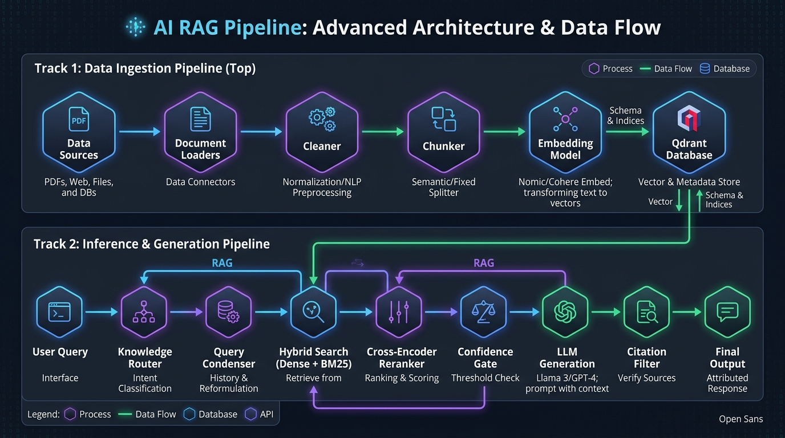
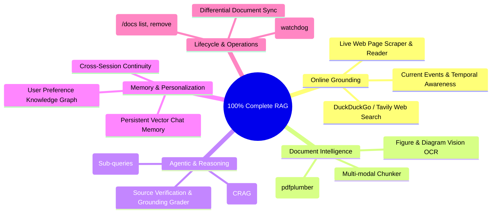

# Thanatos RAG System: Complete Architecture, Flow Diagrams & Roadmap

---

## 1. Complete Visual Architecture & Flow Diagram

### Node Legend & Structure:
- **Circles `((...))`**: Operations, Models & Processing Functions
- **Rectangles `[...]`**: Subsystems & Component Modules
- **Diamonds `{...}`**: Decision Routers & Quality Checks
- **Cylinders `[(...)]`**: Persistent Storage & Memory
- **Rounded Boxes `([...])`**: External Inputs & Outputs

```mermaid
flowchart TD
    %% Styling classes
    classDef ioNode fill:#1E293B,stroke:#38BDF8,stroke-width:2px,color:#F8FAFC;
    classDef processNode fill:#0F172A,stroke:#A855F7,stroke-width:2px,color:#F8FAFC;
    classDef boxNode fill:#1E1E2E,stroke:#64748B,stroke-width:2px,color:#F8FAFC;
    classDef decisionNode fill:#312E81,stroke:#818CF8,stroke-width:2px,color:#F8FAFC;
    classDef dbNode fill:#064E3B,stroke:#34D399,stroke-width:2px,color:#F8FAFC;

    %% --------------------------------------------------------
    %% TRACK 1: INGESTION PIPELINE (Offline / Indexing Time)
    %% --------------------------------------------------------
    subgraph INGESTION ["TRACK 1: DOCUMENT INGESTION PIPELINE"]
        FILE_IN(["📄 Local Files<br>(PDF, DOCX, TXT, MD)"]):::ioNode
        P_LOAD(("(( 1. Extract Text ))<br>PyMuPDF / docx2txt")):::processNode
        P_CLEAN(("(( 2. Normalize Text ))<br>TextCleaner")):::processNode
        P_CHUNK(("(( 3. Semantic Chunking ))<br>Window + 10% Overlap")):::processNode
        
        M_EMBED(("(( 4a. Vector Embed ))<br>Qwen3-Embedding-0.6B")):::processNode
        M_BM25(("(( 4b. Lexical Tokenize ))<br>BM25 Analyzer")):::processNode
        
        DB_VEC[("🗄️ Qdrant Vector Store<br>(Embeddings + Metadata)")]:::dbNode
        DB_BM25[("💾 BM25 Inverted Index<br>(bm25_index.pkl)")]:::dbNode

        FILE_IN --> P_LOAD
        P_LOAD --> P_CLEAN
        P_CLEAN --> P_CHUNK
        P_CHUNK -->|Chunks + Metadata| M_EMBED
        P_CHUNK -->|Tokenized Text| M_BM25
        M_EMBED -->|Upsert Vectors| DB_VEC
        M_BM25 -->|Persist Index| DB_BM25
    end

    %% --------------------------------------------------------
    %% TRACK 2: RUNTIME INFERENCE PIPELINE (Query Time)
    %% --------------------------------------------------------
    subgraph INFERENCE ["TRACK 2: RUNTIME QUERY & RAG INFERENCE PIPELINE"]
        U_IN(["👤 User Query<br>(Text or Voice)"]):::ioNode
        
        %% Step 1: Brain Intent
        INTENT{"Decision 1:<br>System Intent?"}:::decisionNode
        TOOL_EXEC[("⚙️ OS Executor<br>(App, File, Spotify)")]:::boxNode
        
        %% Step 2: Knowledge Router
        K_ROUTER{"Decision 2:<br>Knowledge Need?"}:::decisionNode
        
        %% Step 3: Multi-turn Context Condensation
        MEM[("🧠 Multi-turn Memory<br>(Conversation History)")]:::dbNode
        P_CONDENSE(("(( Query Condenser ))<br>Pronoun & Ellipsis Resolver")):::processNode

        %% Step 4: Dual-Track Retrieval
        P_DENSE(("(( Dense Search ))<br>Cosine Vector Match")):::processNode
        P_SPARSE(("(( Sparse Search ))<br>BM25 Term Match")):::processNode

        %% Step 5: Fusion & Re-ranking
        P_RRF(("(( Reciprocal Rank Fusion ))<br>RRF Score Merging")):::processNode
        P_RERANK(("(( Cross-Encoder Rerank ))<br>Pairwise Relevance Scoring")):::processNode
        P_DEDUP(("(( BetterContext Filter ))<br>Semantic Redundancy Check")):::processNode

        %% Step 6: Confidence Gate
        CONF_GATE{"Decision 3:<br>Confidence Score<br>>= 0.35 ?"}:::decisionNode
        
        %% Step 7: Prompt & Generation
        P_PROMPT["Assemble Context & Rules<br>(Multi-chunk boundaries)"]:::boxNode
        M_LLM(("(( Ollama LLM ))<br>qwen2.5-coder:7b<br>(temp = 0.0)")):::processNode
        
        %% Step 8: Citation Validation
        P_CITE(("(( Citation Auditor ))<br>Regex parse & page deduplication")):::processNode
        
        %% Final Delivery
        U_OUT(["🖥️ Thanatos Response<br>(Answer + Verified [Source N] Pages)"]):::ioNode
    end

    %% Flow Connections
    U_IN --> INTENT
    INTENT -->|Action: open_app / play_music| TOOL_EXEC
    INTENT -->|Action: chat| K_ROUTER
    
    %% Router branches
    K_ROUTER -->|CONVERSATIONAL| M_LLM
    K_ROUTER -->|HYBRID| P_CONDENSE
    K_ROUTER -->|DOCUMENT_RETRIEVAL| P_CONDENSE

    MEM -.->|Past Turns| P_CONDENSE
    
    %% Condenser to Retrieval
    P_CONDENSE -->|Self-Contained Query| P_DENSE
    P_CONDENSE -->|Self-Contained Query| P_SPARSE
    
    DB_VEC -.->|Vector Scan| P_DENSE
    DB_BM25 -.->|Keyword Match| P_SPARSE
    
    P_DENSE -->|Top Vector Chunks| P_RRF
    P_SPARSE -->|Top Lexical Chunks| P_RRF
    
    P_RRF -->|Fused Ranked Chunks| P_RERANK
    P_RERANK -->|Top 5 Scored Chunks| P_DEDUP
    P_DEDUP -->|Distinct Context Chunks| CONF_GATE
    
    %% Confidence fallback vs grounded synthesis
    CONF_GATE -->|FAIL: Score < 0.35| M_LLM
    CONF_GATE -->|PASS: Relevant Evidence| P_PROMPT
    
    P_PROMPT --> M_LLM
    M_LLM --> P_CITE
    P_CITE --> U_OUT
```

---

## 2. What Our Current RAG Pipeline Can Do Right Now

The engine currently provides an **advanced, production-grade local hybrid RAG system**:

| Subsystem | What It Does | Why It Matters |
| :--- | :--- | :--- |
| **1. Dual-Track Hybrid Retrieval** | Runs **Dense Vector Search** (Qwen3 Embeddings) and **Sparse Lexical Search** (BM25 Okapi) simultaneously. | Vector search understands concepts even with different words. BM25 catches exact author names, acronyms, and product codes that vector search often misses. |
| **2. Reciprocal Rank Fusion (RRF)** | Fuses vector and lexical rankings mathematically using $1 / (60 + \text{rank})$. | Balances both search types without manually guessing weighting parameters. |
| **3. Cross-Encoder Neural Reranking** | Scores query-chunk pairs using a deep cross-attention transformer. | Filters out misleading vector neighbors and puts the most relevant paragraph at the very top. |
| **4. Redundancy Elimination (`BetterContext`)** | Computes cosine similarity between retrieved chunks; drops any chunk with $>0.85$ semantic overlap with an earlier chunk. | Prevents sending the same information 3 times to the LLM, saving token budget and latency. |
| **5. Cognitive Knowledge Routing** | `KnowledgeRouter` automatically classifies user input into `CONVERSATIONAL`, `DOCUMENT_RETRIEVAL`, or `HYBRID`. | Users can ask questions naturally without having to type commands like `"search document"`. |
| **6. Multi-Turn Pronoun Resolution** | `QueryCondenser` rewrites ambiguous follow-ups into standalone questions. | Follow-ups work naturally (e.g. Turn 1: *"Who wrote aiml.pdf?"* $\to$ Turn 2: *"What college is he from?"* $\to$ resolves *"he"* to *"Dr. Prashanta Kumar Patra"*). |
| **7. True Hybrid Knowledge Synthesis** | Special multi-rule prompt allows combining external general knowledge with document facts. | Answers complex mixed queries like *"What is backpropagation, and who wrote the notes in aiml.pdf?"* cleanly. |
| **8. Strict Citation Auditing** | Scans LLM output for `[Source N]` tags, consolidates pages (e.g. `Pages: 1-3`), and drops unreferenced documents. | Ensures the user only sees source cards for documents the model actually cited. |
| **9. Low-Confidence Guard** | If retrieval score is below threshold ($\tau = 0.35$), it refuses to invent facts. | Eliminates hallucinations when querying documents about topics they do not contain. |
| **10. Graceful Degradation** | Wraps Qdrant and SentenceTransformers in fault-tolerant health checks. | If vector storage runs out of memory or locks up, Thanatos continues operating in conversational mode instead of crashing. |

---

## 3. What Is Missing & Future Features for a "Complete 100% RAG"

To evolve from our current **Local Document RAG** into a **Complete 100% Universal RAG System**, here are the specific missing components and roadmap features:

---

### Feature 1: Online Web Grounding & Live Search (Missing)
- **What is missing**: Thanatos cannot browse the internet or retrieve real-time information (e.g., latest software versions, news, live weather).
- **100% RAG Requirement**:
  - Integrate a live search provider (`duckduckgo-search` or Tavily).
  - When `KnowledgeRouter` detects temporal queries (*"today"*, *"latest"*, *"current"*, *"pricing"*), it triggers the web search provider.
  - An HTML text extractor pulls the top 3 web results into ephemeral context.

### Feature 2: Multi-Modal Document Extraction (Tables & Figures)
- **What is missing**: Tables in PDFs lose column alignment when converted to plain text; images and charts are currently ignored.
- **100% RAG Requirement**:
  - Implement structured table parsing (using `pdfplumber` or `marker`) to convert tables into clean Markdown tables.
  - Route embedded PDF diagrams through Thanatos's vision model (`VisionModel`) to generate text descriptions before indexing.

### Feature 3: Corrective RAG (CRAG) & Self-Reflective Grader
- **What is missing**: The system currently makes a single retrieval pass. If the retrieved context is marginally relevant, it has no self-correction mechanism.
- **100% RAG Requirement**:
  - **Retrieval Grader**: An LLM step grades retrieved chunks as `RELEVANT` or `IRRELEVANT`.
  - If graded `IRRELEVANT`, the system rewrites the query or falls back to Web Search automatically.

### Feature 4: Query Decomposition (Multi-Hop Complex Questions)
- **What is missing**: Single-query retrieval cannot answer questions requiring information from two separate chapters or documents (e.g., *"Compare the algorithm in paper A with the benchmark in paper B"*).
- **100% RAG Requirement**:
  - Break complex questions into 2 or 3 sub-queries.
  - Retrieve evidence for each sub-query independently, then concatenate into a single synthesized context.

### Feature 5: Persistent Episodic Memory (Cross-Session Chat History)
- **What is missing**: Conversation history lives in memory during runtime and vanishes when the program closes.
- **100% RAG Requirement**:
  - Save conversational turns into a dedicated Qdrant collection (`thanatos_conversations`).
  - Search past discussions across days or weeks to maintain long-term user context.

### Feature 6: Document Lifecycle Management & Folder Watcher
- **What is missing**: No CLI command to see what is currently indexed, no command to delete a file's vectors, and no auto-sync.
- **100% RAG Requirement**:
  - CLI commands: `/docs list`, `/docs remove <filename>`, `/docs clear`.
  - A background file watcher (`watchdog`) monitoring `Thanatos/Knowledge/`: automatically indexes new files and deletes vectors when a file is removed.
