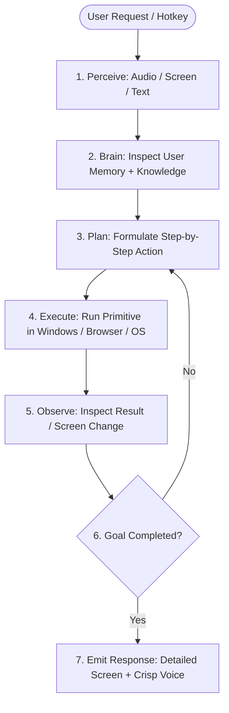
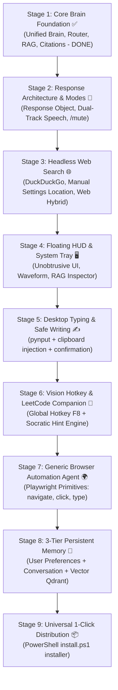

# Thanatos: The Autonomous Desktop "Jarvis" Roadmap & Architecture

This document defines the complete architectural evolution of **Thanatos** from a local RAG assistant into a fully orchestrated, hands-free personal desktop AI assistant ("Jarvis").

---

## 1. System Philosophy: Orchestration Over Features

> **"Don't build 7 disconnected features. Build one cognitive system that happens to have 7 capabilities."**

Thanatos is organized into **five core structural layers**:

```text
                    THANATOS (Core Orchestrator)
                                │
        ┌───────────────────────┴───────────────────────┐
        │                                               │
      INPUT                                           OUTPUT
(Voice / Text / Hotkey)                       (Screen Display / Voice TTS)
        │                                               │
        └───────────────────────┬───────────────────────┘
                                │
                              BRAIN
                                │
        ┌───────────────────────┼───────────────────────┐
        │                       │                       │
     MEMORY                 KNOWLEDGE                 INTENT
(3-Tier Memory)         (RAG / Web / Hybrid)      (Action Classifier)
        │                       │                       │
        └───────────────────────┬───────────────────────┘
                                │
                             EXECUTOR
                                │
       ┌────────────────────────┼────────────────────────┐
       │                        │                        │
    WINDOWS                  BROWSER                   FILES
(Apps / Shortcuts)     (Generic Primitives)     (Typing / Ingestion)
```

The goal is not to add random scripts, but to enable Thanatos to:
1. **Perceive** what the user is doing (Screen, Voice, Hotkey).
2. **Consult Knowledge** (Local RAG, Web, or User Memory).
3. **Plan & Execute** safe actions through clean primitives.
4. **Present the Result Appropriately** (Detailed on-screen, concise through voice).

---

## 2. Core Architectural Decisions

### A. The 3-Tier Memory Architecture
Memory is explicitly partitioned into three specialized stores instead of a single growing list:

```text
Memory Subsystem
├── ConversationMemory   -> Short-term recent dialogue turns ("What did I just ask?")
├── KnowledgeBase        -> Indexed documents, PDFs, manuals in Qdrant + BM25
└── UserMemory           -> Persistent facts ("My name is Gaurav, I code in Python/Rust, I prefer dark mode")
```

### B. The Structured `Response` Object (Dual-Track Output)
The Brain never decides display formatting or TTS audio playback directly. Instead, it emits a standardized `Response` contract:

```python
@dataclass
class Response:
    display_text: str       # Full markdown, code blocks, derivations, tables
    speech_text: str        # 1-2 sentence conversational punchline
    sources: str | None     # Verified source citations
    metadata: dict          # State, latency, confidence score, intent
```

- **Screen / UI Handler** renders `display_text` + `sources`.
- **TextToSpeech Engine** vocalizes `speech_text` using the soothing neural voice.

### C. The Cognitive Agent Loop
Replaces brittle single-shot intent execution with an iterative cognitive cycle:



### D. Security & Side-Effect Confirmation Gate
Actions with external or destructive side-effects must pass through a 2-step preview gate:
- **Safe (Auto-execute)**: App launch, local web search, document retrieval, screen reading, typing into focused app.
- **Potentially Destructive (Requires Preview & Confirmation)**: Sending emails/messages, deleting files, purchasing, posting online, PC shutdown.

---

## 3. Revised Implementation Roadmap



---

### Stage 1: Core Brain & RAG Foundation (Status: ✅ COMPLETED)
- **Implemented & Verified**:
  - `KnowledgeRouter` (3-way classification: `CONVERSATIONAL`, `DOCUMENT_RETRIEVAL`, `HYBRID`).
  - `QueryCondenser` (multi-turn pronoun and ellipsis resolution).
  - Hybrid RAG (Qdrant Dense + BM25 Sparse + Cross-Encoder Reranker + `BetterContext`).
  - Strict citation auditing & low-confidence threshold fallback ($\tau = 0.35$).
  - Streamlined `__main__.py` intent routing; all queries pass through `Brain.respond()`.
  - All 5 end-to-end integration tests in `tests/test_brain_rag_integration.py` passing 100% green.

---

### Stage 2: Response Object Architecture & Dual-Track Output (CURRENT TARGET)
- **Goal**: Cleanly decouple what is seen from what is spoken, and provide instant voice/silent toggles.
- **Implementation**:
  1. Define `src/engine/core/response.py`:
     ```python
     @dataclass
     class Response:
         display_text: str
         speech_text: str
         sources: str | None = None
         metadata: dict = field(default_factory=dict)
     ```
  2. Update `Brain.respond(message) -> Response`:
     - Generates comprehensive technical explanation on screen.
     - Synthesizes a crisp 1–2 sentence vocal summary + *"I've displayed the full details on your screen."*
  3. Update `__main__.py`:
     - Screen prints `response.display_text` (and sources).
     - TTS speaks `response.speech_text`.
  4. Quick Mode Switching:
     - `/voice`: Voice input + audio output.
     - `/mute` or `/silent`: Silent text-only mode (no audio).
     - Enter on empty prompt: Activates push-to-talk voice mode.

---

### Stage 3: Headless Web Search & Knowledge Hierarchy
- **Goal**: Answer real-time inquiries (*"Latest version of PyTorch"*, *"Best dosa in Kolkata"*) without launching a browser.
- **Architecture**:
  1. Expand `KnowledgeRouter` into a clean 4-tier hierarchy:
     ```text
     KnowledgeRouter
     ├── LOCAL_KNOWLEDGE (RAG via Qdrant/BM25)
     ├── WEB_SEARCH      (DuckDuckGo headless search)
     ├── HYBRID          (Local notes + Live Web / General Theory)
     └── CHAT            (Direct conversational LLM)
     ```
  2. Implement `src/engine/web/search.py`:
     - Uses `duckduckgo-search` to fetch top 3–5 search cards in ~400ms.
  3. Location Configuration:
     - Keep location decoupled from Brain infrastructure.
     - Read default from `config.json`: `{"location": "Kolkata, India"}` (customizable by user).

---

### Stage 4: Floating HUD & System Tray UI
- **Goal**: An unobtrusive, modern desktop companion that stays out of your way while you code.
- **Form Factor**:
  1. **System Tray Integration**: Thanatos lives in the Windows taskbar tray (`^`) and runs silently in the background.
  2. **Floating Pill / HUD Widget**:
     - Visual state indicator (`Idle`, `Listening`, `Thinking`, `Searching Web`, `Executing`).
     - Animated audio waveform when Thanatos speaks.
     - RAG Inspector: Displays retrieved chunks, sources, and confidence score during development.
     - Drag-and-drop PDF dropzone for instant document indexing.
  3. **Stack**: FastAPI WebSocket backend (`localhost:8765`) + React/Vite + Tauri (lightweight native Windows executable).

---

### Stage 5: Desktop Typing & Safe Writing Automation
- **Goal**: Dictate emails, essays, or notes directly into your active window with safety confirmations.
- **Workflow**:
  1. User says: *"Thanatos, write an email asking for an extension on the project."*
  2. Intent maps to `action: "write_text"`.
  3. LLM drafts the text.
  4. Safe text pasting: copies to clipboard (`pyperclip.copy`) and triggers `Ctrl + V` into the focused text editor.
  5. **Safety Gate**: If the user asks to *send* or *execute* an external action, Thanatos displays a preview and requires verbal/text confirmation (`yes`/`no`) before execution.

---

### Stage 6: Vision Hotkey & LeetCode DSA Companion
- **Goal**: Fullscreen screen-aware algorithmic mentor without Alt-Tabbing.
- **Iterative Milestones**:
  - **Level 1**: Global hotkey (`F8` or `Ctrl + Alt + Space`) captures screen $\to$ *"What am I looking at?"*
  - **Level 2 (Socratic Hint)**: Identifies the LeetCode problem + user's code, pinpoints the bottleneck, and whispers a 1-sentence algorithmic nudge into headphones without giving away code.
  - **Level 3 (Interactive Debugging)**: Follow-ups: *"Why does this test case fail?"*, *"Show me the time complexity"*.

---

### Stage 7: Generic Browser Automation Primitives
- **Goal**: Headless or visible browser tasks using clean, reusable automation primitives rather than brittle website-specific hacks.
- **Implementation**:
  - Build `BrowserAgent` using Playwright with core primitives:
    - `navigate(url)`
    - `search(query)`
    - `click(selector_or_text)`
    - `type(text)`
    - `extract(selector)`
    - `close()`
  - High-level streaming / search tasks are built as recipes on top of these primitives.

---

### Stage 8: 3-Tier Persistent Memory
- **Goal**: Cross-session user personalization and continuous learning.
- **Implementation**:
  - Store user preferences, active projects, and personal facts in a local SQLite / JSON store (`UserMemory`).
  - Automatically inject relevant user context into `Brain.respond()`.

---

### Stage 9: Universal 1-Click Terminal Distribution
- **Goal**: Effortless installation for anyone on Windows.
- **Implementation** (Only when stages 1–8 are frozen and stable):
  ```powershell
  irm https://raw.githubusercontent.com/Gaurav01001/Thanatos/main/install.ps1 | iex
  ```
  Sets up portable virtualenv, pulls models, and binds global `thanatos` command to PATH.
